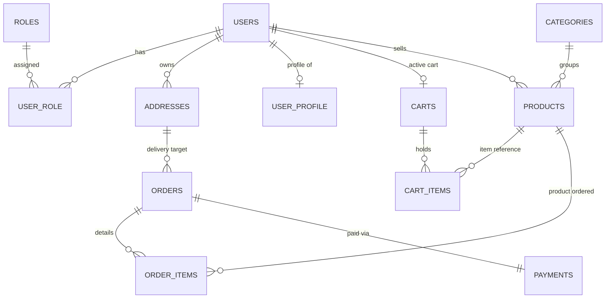
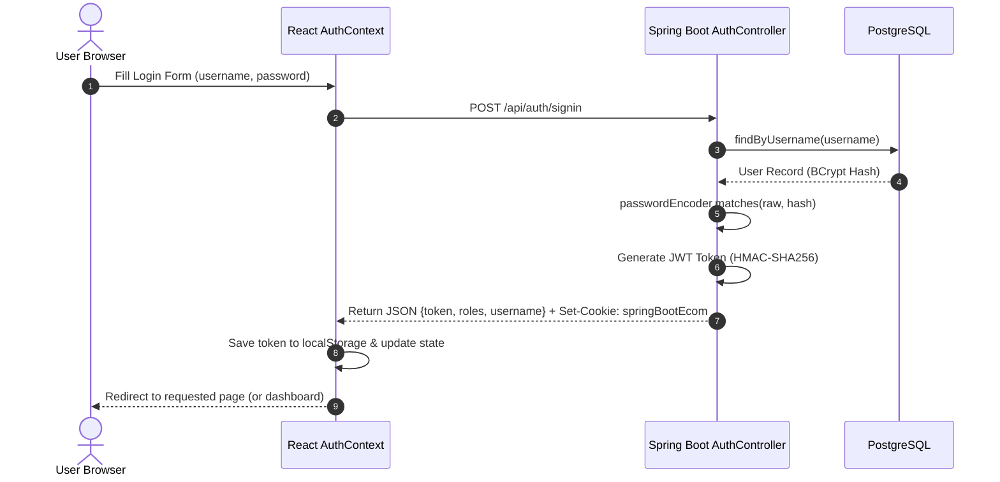
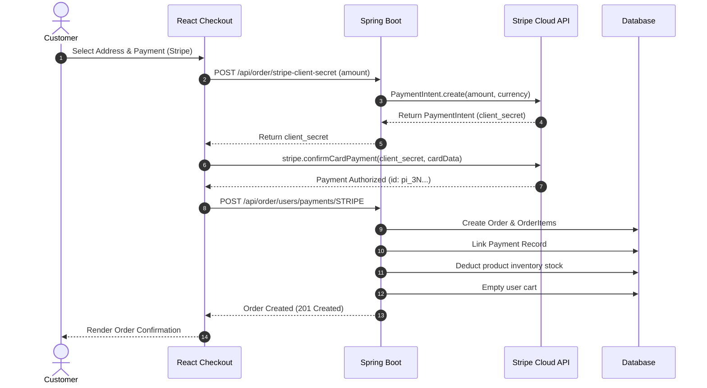
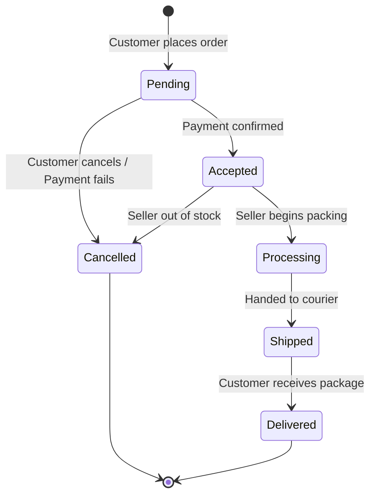

# 📖 Aureza E-Commerce Platform — End-to-End Technical Documentation

> **Project Name**: Aureza E-Commerce Application  
> **Source Repository**: [https://github.com/TaquiAlam/Aureza-EcommerceApplication.git](https://github.com/TaquiAlam/Aureza-EcommerceApplication.git)  
> **Author**: Mohammad Taqui Alam  
> **Date**: September 2026  
> **Version**: 1.0.0-RELEASE  

---

## 📑 Table of Contents

1. [System Overview & Business Domain](#1-system-overview--business-domain)
2. [End-to-End Architectural Architecture](#2-end-to-end-architectural-architecture)
3. [Domain Data Models & Database Schema](#3-domain-data-models--database-schema)
4. [Security Architecture & Role-Based Access Control (RBAC)](#4-security-architecture--role-based-access-control-rbac)
5. [Complete REST API Reference](#5-complete-rest-api-reference)
   - [5.1 Authentication & User APIs](#51-authentication--user-apis)
   - [5.2 Product Management APIs](#52-product-management-apis)
   - [5.3 Category Management APIs](#53-category-management-apis)
   - [5.4 Cart Management APIs](#54-cart-management-apis)
   - [5.5 Address Management APIs](#55-address-management-apis)
   - [5.6 Order & Stripe Payment APIs](#56-order--stripe-payment-apis)
   - [5.7 Admin Analytics APIs](#57-admin-analytics-apis)
6. [Frontend Architecture & Component System](#6-frontend-architecture--component-system)
   - [6.1 Atomic Design System Hierarchy](#61-atomic-design-system-hierarchy)
   - [6.2 State Management Architecture](#62-state-management-architecture)
   - [6.3 Routing & Route Guards](#63-routing--route-guards)
   - [6.4 Network Layer & Interceptors](#64-network-layer--interceptors)
7. [Core Business Workflows & State Machines](#7-core-business-workflows--state-machines)
   - [7.1 Authentication & Cookie/Token Handshake](#71-authentication--cookietoken-handshake)
   - [7.2 Cart Lifecycle & Pricing Calculation](#72-cart-lifecycle--pricing-calculation)
   - [7.3 Checkout & Stripe Payment Lifecycle](#73-checkout--stripe-payment-lifecycle)
   - [7.4 Multi-Vendor Order Fulfillment State Machine](#74-multi-vendor-order-fulfillment-state-machine)
8. [Global Exception Handling & Error Resolution](#8-global-exception-handling--error-resolution)
9. [Deployment & Production Environment Configuration](#9-deployment--production-environment-configuration)
10. [Developer Troubleshooting & FAQ](#10-developer-troubleshooting--faq)

---

## 1. System Overview & Business Domain

**Aureza** is an enterprise-scale, multi-vendor electronic commerce platform designed to facilitate secure transactions between customers, vendors (sellers), and platform administrators. 

### Key Stakeholders
1. **Customers (Buyers)**: Discover products via keyword search or category taxonomies, manage shopping carts, maintain address books, and perform checkout via credit/debit card (Stripe), UPI, or Cash-on-Delivery.
2. **Sellers (Vendors)**: Self-manage inventory, define original pricing and promotional discounts, upload product imagery, and fulfill orders related to their items.
3. **Platform Administrators**: Supervise system telemetry (sales volume, total revenue, active users), moderate user roles, control category hierarchies, and manage all orders platform-wide.

---

## 2. End-to-End Architectural Architecture

The system operates on a modern, decoupled **Single Page Application (SPA) + Stateless RESTful Backend** architecture.

```
+-----------------------------------------------------------------------------------+
|                                 CLIENT TIER                                       |
|                                                                                   |
|   +---------------------------------------------------------------------------+   |
|   |                       React 19 Single Page App                            |   |
|   |  - React Router v7 (Client-side routing & dynamic route guards)           |   |
|   |  - Tailwind CSS v4 + Lucide Icons (Atomic design presentation)            |   |
|   |  - Axios HTTP Client (Bearer Token Interceptors + Global Error Toasts)    |   |
|   |  - React Context (AuthContext session & CartContext sync)                 |   |
|   |  - Stripe Elements SDK (Client-side tokenization)                         |   |
|   +---------------------------------------------------------------------------+   |
+------------------------------------------+----------------------------------------+
                                           | HTTPS / JSON
                                           v
+-----------------------------------------------------------------------------------+
|                             API & SECURITY GATEWAY                                |
|                                                                                   |
|   +---------------------------------------------------------------------------+   |
|   |                        Spring Security Filter Chain                       |   |
|   |  1. CorsFilter (Origin allowance: Vercel & localhost)                     |   |
|   |  2. AuthTokenFilter (Extracts JWT from Bearer header or HttpOnly cookie)  |   |
|   |  3. JwtUtils (HMAC-SHA256 signature validation & role authority unpack)   |   |
|   |  4. SecurityContextHolder (Injected with authenticated principal)         |   |
|   +---------------------------------------------------------------------------+   |
+------------------------------------------+----------------------------------------+
                                           |
                                           v
+-----------------------------------------------------------------------------------+
|                             SPRING BOOT 4 BACKEND                                 |
|                                                                                   |
|   +-------------------+  +--------------------+  +----------------------------+   |
|   |  REST Controllers |  |   Service Layer    |  |     Data Access (JPA)      |   |
|   |  - AuthController |  | - AuthService      |  | - UserRepository           |   |
|   |  - ProductCtrl    |  | - ProductService   |  | - ProductRepo              |   |
|   |  - OrderCtrl      |  | - OrderService     |  | - OrderRepo / OrderItemRepo|   |
|   |  - CartCtrl       |  | - CartService      |  | - CartRepository           |   |
|   |  - AddressCtrl    |  | - StripeService    |  | - AddressRepo              |   |
|   |  - AnalyticsCtrl  |  | - AnalyticsService |  | - PaymentRepo              |   |
|   +-------------------+  +--------------------+  +----------------------------+   |
+--------------------+-------------------------------------+------------------------+
                     |                                     |
                     v                                     v
+---------------------------------------+  +----------------------------------------+
|         DATA PERSISTENCE TIER         |  |         EXTERNAL INTEGRATIONS          |
|                                       |  |                                        |
|  PostgreSQL 16 Relational Database    |  |  Stripe Payments API (v33.4.0)         |
|  - ACID-compliant transactions        |  |  - PaymentIntent generation            |
|  - Foreign key cascades & indexing    |  |  - Real-time webhook & confirmation    |
+---------------------------------------+  +----------------------------------------+
```

---

## 3. Domain Data Models & Database Schema

The persistence layer is mapped using **Spring Data JPA / Hibernate** to a PostgreSQL relational database.

### 3.1 Entity Relationship Diagram



### 3.2 Relational Entity Schema Details

#### `users` (Account Entity)
| Column Name | SQL Type | Constraints | Description |
| :--- | :--- | :--- | :--- |
| `user_id` | `BIGINT` | `PRIMARY KEY, AUTO_INCREMENT` | Unique identifier for user |
| `user_name` | `VARCHAR(20)` | `NOT NULL, UNIQUE` | Chosen unique username |
| `user_email` | `VARCHAR(50)` | `NOT NULL, UNIQUE` | Account email address |
| `user_password`| `VARCHAR(100)`| `NOT NULL` | BCrypt encrypted hash |

#### `roles` (Security Authority Entity)
| Column Name | SQL Type | Constraints | Description |
| :--- | :--- | :--- | :--- |
| `role_id` | `INTEGER` | `PRIMARY KEY, AUTO_INCREMENT` | Unique role identifier |
| `role_name` | `VARCHAR(255)`| `NOT NULL` | Enum: `ROLE_USER`, `ROLE_SELLER`, `ROLE_ADMIN` |

#### `user_role` (Many-to-Many Join Table)
- `user_id` (`BIGINT`, Foreign Key references `users.user_id`)
- `role_id` (`INTEGER`, Foreign Key references `roles.role_id`)

#### `products` (Catalog Items)
| Column Name | SQL Type | Constraints | Description |
| :--- | :--- | :--- | :--- |
| `product_id` | `BIGINT` | `PRIMARY KEY, AUTO_INCREMENT` | Unique product identifier |
| `product_name` | `VARCHAR(255)` | `NOT NULL` | Display title |
| `product_description` | `VARCHAR(1000)`| `NOT NULL` | Detailed specifications |
| `image` | `VARCHAR(255)` | `NULLABLE` | Local path or remote URL |
| `quantity` | `INTEGER` | `NOT NULL` | Available inventory stock |
| `price` | `DOUBLE PRECISION`| `NOT NULL` | Base Retail Price (MSRP) |
| `discount` | `DOUBLE PRECISION`| `DEFAULT 0.0` | Discount percentage (0–100%) |
| `special_price` | `DOUBLE PRECISION`| `NOT NULL` | Computed price: `price - (price * discount / 100)` |
| `category_id` | `BIGINT` | `FOREIGN KEY` | Category reference |
| `seller_id` | `BIGINT` | `FOREIGN KEY` | Owner merchant reference |

#### `category_model` (Product Taxonomy)
| Column Name | SQL Type | Constraints | Description |
| :--- | :--- | :--- | :--- |
| `id` | `BIGINT` | `PRIMARY KEY, AUTO_INCREMENT` | Unique category identifier |
| `category_name` | `VARCHAR(255)` | `NOT NULL, UNIQUE` | Category title |

#### `carts` & `cart_items`
- `carts`: `cart_id` (PK), `user_id` (FK, unique 1-to-1 with User), `total_price` (`DOUBLE PRECISION`).
- `cart_items`: `cart_item_id` (PK), `cart_id` (FK), `product_id` (FK), `quantity` (`INTEGER`), `product_price` (`DOUBLE PRECISION`), `discount` (`DOUBLE PRECISION`).

#### `orders` & `order_items`
- `orders`: `order_id` (PK), `email` (`VARCHAR`), `order_date` (`DATE`), `total_amount` (`DOUBLE PRECISION`), `order_status` (`VARCHAR`), `address_id` (FK), `payment_id` (FK).
- `order_items`: `order_item_id` (PK), `order_id` (FK), `product_id` (FK), `quantity` (`INTEGER`), `discount` (`DOUBLE PRECISION`), `ordered_product_price` (`DOUBLE PRECISION`).

#### `payments` (Financial Transaction Record)
| Column Name | SQL Type | Description |
| :--- | :--- | :--- |
| `payment_id` | `BIGINT` (PK) | Unique payment record ID |
| `payment_method` | `VARCHAR` | `STRIPE`, `UPI`, `COD` |
| `pg_payment_id` | `VARCHAR` | Gateway identifier (e.g. `pi_3N...` or UPI Transaction ID) |
| `pg_status` | `VARCHAR` | `succeeded`, `COMPLETED`, `PENDING`, `FAILED` |
| `pg_response_message`| `VARCHAR` | Gateway status response string |
| `pg_name` | `VARCHAR` | Name of gateway provider (`Stripe`, `UPI`, `Manual`) |

---

## 4. Security Architecture & Role-Based Access Control (RBAC)

Aureza implements a defense-in-depth security model using **Spring Security 6** with **Stateless JWT Tokens**:

### 4.1 Authentication Lifecycle
1. **Password Encoding**: Passwords are processed via `BCryptPasswordEncoder` with strength factor 10. Raw passwords are never stored in memory or persistence.
2. **JWT Structure**:
   - **Header**: `{"alg": "HS256", "typ": "JWT"}`
   - **Claims Payload**:
     - `sub`: Username
     - `roles`: `["ROLE_USER", "ROLE_SELLER"]`
     - `iat`: Timestamp of creation
     - `exp`: Configured expiration timestamp (`3,000,000 ms` ~ 50 minutes)
   - **Signature**: HMAC-SHA256 signature generated with `spring.app.jwtSecret`.
3. **Dual Delivery Scheme**:
   - Tokens are set as an `HttpOnly`, `SameSite=Lax` cookie (`springBootEcom`) for browser CSRF mitigation.
   - Concurrently returned in the JSON payload and held in `localStorage` to be passed as an `Authorization: Bearer <token>` header by Axios.

### 4.2 Endpoint Authorization Rules (`securityConfig.java`)
```java
http.authorizeHttpRequests(auth -> auth
    // Public Endpoints
    .requestMatchers("/api/auth/**").permitAll()
    .requestMatchers("/api/public/**").permitAll()
    .requestMatchers("/v3/api-docs/**", "/swagger-ui/**").permitAll()
    .requestMatchers("/images/**", "/api/images/**").permitAll()
    .requestMatchers(HttpMethod.OPTIONS, "/**").permitAll()

    // Seller Role Protected Endpoints
    .requestMatchers("/api/seller/**").hasAnyRole("ADMIN", "SELLER")

    // Admin Role Protected Endpoints
    .requestMatchers("/api/admin/**").hasRole("ADMIN")

    // Authenticated Users (Customers, Sellers, Admins)
    .anyRequest().authenticated()
);
```

---

## 5. Complete REST API Reference

Base URL (Local): `http://localhost:8080`  
Base URL (Cloud): `https://aureza-backend.onrender.com`

### 5.1 Authentication & User APIs

#### `POST /api/auth/signup`
Registers a new account.
- **Access**: Public
- **Request Body**:
```json
{
  "username": "johndoe",
  "email": "john@example.com",
  "password": "Password@123",
  "role": ["user", "seller"]
}
```
- **Response**: `200 OK`
```json
{
  "message": "User registered successfully!"
}
```

#### `POST /api/auth/signin`
Authenticates a user and issues a JWT token.
- **Access**: Public
- **Request Body**:
```json
{
  "username": "johndoe",
  "password": "Password@123"
}
```
- **Response**: `200 OK` (Includes `Set-Cookie: springBootEcom=...; HttpOnly`)
```json
{
  "id": 1,
  "jwtToken": "eyJhbGciOiJIUzI1NiJ9...",
  "username": "johndoe",
  "roles": ["ROLE_USER", "ROLE_SELLER"]
}
```

#### `GET /api/auth/user`
Retrieves current session details for the logged-in user.
- **Access**: Authenticated (`ROLE_USER`, `ROLE_SELLER`, `ROLE_ADMIN`)
- **Headers**: `Authorization: Bearer <token>`
- **Response**: `200 OK`
```json
{
  "id": 1,
  "username": "johndoe",
  "roles": ["ROLE_USER"]
}
```

#### `POST /api/auth/signout`
Clears the JWT session cookie.
- **Access**: Authenticated
- **Response**: `200 OK`

---

### 5.2 Product Management APIs

#### `GET /api/public/products`
Retrieves a paginated list of catalog products with dynamic sorting and keyword filtering.
- **Access**: Public
- **Query Parameters**:
  - `keyword` (*optional*): Search query matching product title or description.
  - `category` (*optional*): Category name filter.
  - `pageNumber` (*default: 0*): 0-indexed page number.
  - `pageSize` (*default: 50*): Items per page.
  - `sortBy` (*default: productId*): Sort field (`price`, `productName`, etc.).
  - `sortOrder` (*default: asc*): `asc` or `desc`.
- **Response**: `200 OK`
```json
{
  "content": [
    {
      "productId": 1,
      "productName": "Apple iPhone 15 Pro",
      "image": "https://images.unsplash.com/photo-1695048133142-1a20484d2569",
      "productDescription": "Latest Apple A17 Pro titanium flagship smartphone",
      "quantity": 50,
      "price": 134900.0,
      "discount": 10.0,
      "specialPrice": 121410.0
    }
  ],
  "pageNumber": 0,
  "pageSize": 50,
  "totalElements": 4,
  "totalPages": 1,
  "lastPage": true
}
```

#### `POST /api/seller/categories/{categoryId}/product`
Creates a new product item under the authenticated seller's ownership.
- **Access**: `ROLE_SELLER` or `ROLE_ADMIN`
- **Request Body**:
```json
{
  "productName": "Wireless Gaming Mouse",
  "productDescription": "Ultra-lightweight 26K DPI RGB optical gaming mouse",
  "quantity": 40,
  "price": 4999.0,
  "discount": 15.0
}
```
- **Response**: `201 CREATED`

#### `PUT /api/seller/products/{productId}/image`
Uploads a binary image for the specified product.
- **Access**: `ROLE_SELLER` or `ROLE_ADMIN`
- **Content-Type**: `multipart/form-data`
- **Body Form-Data**: `image: [Binary File]`
- **Response**: `200 OK` (returns updated product object)

---

### 5.3 Category Management APIs

#### `GET /api/public/categories`
- **Access**: Public
- **Response**: `200 OK`
```json
[
  {
    "pageContent": [
      { "id": 1, "categoryName": "Electronics" },
      { "id": 2, "categoryName": "Smartphones" },
      { "id": 3, "categoryName": "Fashion & Wear" }
    ],
    "pageNumber": 0,
    "pageSize": 50,
    "totalElements": 3,
    "totalPages": 1,
    "lastPage": true
  }
]
```

#### `POST /api/admin/categories`
- **Access**: `ROLE_ADMIN`
- **Request Body**: `{"categoryName": "Footwear"}`
- **Response**: `201 CREATED`

---

### 5.4 Cart Management APIs

#### `GET /api/carts/users/cart`
Fetches the active shopping cart for the logged-in user.
- **Access**: Authenticated
- **Response**: `200 OK`
```json
{
  "cartId": 12,
  "totalPrice": 121410.0,
  "products": [
    {
      "cartItemId": 5,
      "product": {
        "productId": 1,
        "productName": "Apple iPhone 15 Pro",
        "specialPrice": 121410.0
      },
      "quantity": 1,
      "discount": 10.0,
      "productPrice": 134900.0
    }
  ]
}
```

#### `POST /api/carts/products/{productId}/quantity/{quantity}`
Adds an item to the shopping cart.
- **Access**: Authenticated
- **Response**: `201 CREATED`

#### `PUT /api/cart/products/{productId}/quantity/{operation}`
Adjusts product quantity in cart.
- **Access**: Authenticated
- **Path Parameter**: `operation` can be `"delete"` (-1 item) or `"add"` (+1 item).
- **Response**: `200 OK`

---

### 5.5 Address Management APIs

#### `GET /api/users/addresses`
Retrieves all delivery addresses saved by the logged-in user.
- **Access**: Authenticated
- **Response**: `200 OK`
```json
[
  {
    "addressId": 4,
    "street": "221B Baker Street",
    "buildingName": "Apartment 4B",
    "city": "London",
    "state": "Greater London",
    "country": "United Kingdom",
    "pincode": "NW16XE"
  }
]
```

#### `POST /api/addresses`
Creates and links an address to the user account.
- **Access**: Authenticated
- **Response**: `201 CREATED`

---

### 5.6 Order & Stripe Payment APIs

#### `POST /api/order/stripe-client-secret`
Creates a Stripe `PaymentIntent` and returns the client secret for Stripe Elements.
- **Access**: Authenticated
- **Request Body**:
```json
{
  "amount": 121410,
  "currency": "inr"
}
```
- **Response**: `201 CREATED`
```text
pi_3Nxxxxxxxxxxxxxx_secret_xxxxxxxxxxxxxx
```

#### `POST /api/order/users/payments/{paymentMethod}`
Finalizes order placement from the user's active cart.
- **Access**: Authenticated
- **Path Parameter**: `paymentMethod` (`STRIPE`, `UPI`, `COD`)
- **Request Body**:
```json
{
  "addressId": 4,
  "pgPaymentId": "pi_3Nxxxxxxxxxxxxxx",
  "pgStatus": "succeeded",
  "pgResponseMessage": "Payment completed successfully",
  "pgName": "Stripe"
}
```
- **Response**: `201 CREATED`
```json
{
  "orderId": 8,
  "email": "john@example.com",
  "orderItems": [...],
  "orderDate": "2026-09-26",
  "totalAmount": 121410.0,
  "orderStatus": "Accepted",
  "addressId": 4,
  "payment": {
    "paymentId": 8,
    "paymentMethod": "STRIPE",
    "pgPaymentId": "pi_3Nxxxxxxxxxxxxxx",
    "pgStatus": "succeeded",
    "pgResponseMessage": "Payment completed successfully",
    "pgName": "Stripe"
  }
}
```

#### `GET /api/seller/orders`
Retrieves only orders containing products owned by the authenticated seller.
- **Access**: `ROLE_SELLER` or `ROLE_ADMIN`
- **Response**: `200 OK`

#### `PUT /api/seller/orders/{orderId}/status`
Updates order fulfillment status.
- **Access**: `ROLE_SELLER` or `ROLE_ADMIN`
- **Request Body**:
```json
{
  "status": "Shipped"
}
```
- **Response**: `200 OK`

---

### 5.7 Admin Analytics APIs

#### `GET /api/admin/analytics`
Generates real-time business telemetry for the admin dashboard.
- **Access**: `ROLE_ADMIN`
- **Response**: `200 OK`
```json
{
  "totalOrders": 142,
  "totalSales": 1248500.0,
  "totalProducts": 48,
  "totalUsers": 312
}
```

---

## 6. Frontend Architecture & Component System

The frontend is constructed using modern **React 19**, **Vite**, and **Tailwind CSS v4** following the **Atomic Design Methodology**.

### 6.1 Atomic Design System Hierarchy

```
src/components/
├── atoms/                     # Pure, stateless primitive components
│   ├── Button.jsx             # Primary, secondary, outline, danger button variants
│   ├── Input.jsx              # Reusable text/number/email inputs with validation styles
│   ├── Badge.jsx              # Status badges (Pending, Delivered, Cancelled)
│   ├── Spinner.jsx            # Loading indicators
│   └── EmptyState.jsx         # Fallback view for empty lists/cart
│
├── molecules/                 # Compositions of 2+ atoms
│   ├── FormField.jsx          # Label + Input + Validation error message
│   ├── SearchBar.jsx          # Input with search icon, clear button, debounce
│   ├── QuantityControl.jsx    # Plus / Minus / Count steppers for cart items
│   ├── PriceDisplay.jsx       # Strikethrough MSRP + Discount Badge + Special Price
│   └── Pagination.jsx         # Page navigation controls
│
├── organisms/                 # Functional UI sections
│   ├── Navbar.jsx             # Responsive navigation bar with role badges & cart count
│   ├── Footer.jsx             # Brand links, social media, policies
│   ├── ProductCard.jsx        # Product preview with discount calculation & quick add
│   ├── ProductGrid.jsx        # Responsive responsive CSS grid with loading skeletons
│   ├── CartItem.jsx           # Individual cart row with live quantity changer
│   ├── CheckoutStepper.jsx    # 3-step indicator (Address -> Payment -> Review)
│   └── PaymentForm.jsx        # Stripe CardElement integration form
│
└── templates/                 # Reusable structural layout wrappers
    ├── MainLayout.jsx         # Public/Customer layout (Navbar + Outlet + Footer)
    ├── AdminLayout.jsx        # Admin dashboard layout (Sidebar + Header + Content)
    ├── SellerLayout.jsx       # Seller portal layout (Sidebar + Inventory + Orders)
    └── PrivateRoute.jsx       # Route guard inspecting JWT roles
```

### 6.2 State Management Architecture

State is cleanly partitioned into two domain contexts:

1. **`AuthContext.jsx`**:
   - Stores `user` object (`id`, `username`, `roles`).
   - Tracks `token` in memory and synchronization with `localStorage`.
   - Exposes authentication helpers: `login()`, `register()`, `logout()`, `hasRole(role)`.
2. **`CartContext.jsx`**:
   - Manages local `cartCount` for the Navbar badge.
   - Provides global `refreshCart()` function triggered whenever items are added or deleted.

### 6.3 Routing & Route Guards (`App.jsx` & `PrivateRoute.jsx`)

Routes are partitioned into 4 distinct security tiers:
- **Public Routes**: `/`, `/products`, `/products/:id`, `/about`, `/contact`, `/cart`.
- **Public-Only Routes**: `/login`, `/signup` (automatically redirects logged-in users to `/`).
- **Customer Protected Routes**: `/profile`, `/addresses`, `/checkout`, `/order-confirm` (requires valid JWT).
- **Seller Protected Routes**: `/seller/*` (requires `ROLE_SELLER` or `ROLE_ADMIN`).
- **Admin Protected Routes**: `/admin/*` (requires `ROLE_ADMIN`).

### 6.4 Network Layer & Interceptors (`axiosConfig.js`)
- **Base URL Resolution**: Automatically points to `http://localhost:8080/api` in development or `https://aureza-backend.onrender.com/api` in production.
- **Request Interceptor**: Extracts JWT token from `localStorage` and appends `Authorization: Bearer <token>`. Handles `FormData` content-type boundaries automatically.
- **Response Interceptor**: Detects HTTP 500+ server failures and triggers unified error toasts via `react-hot-toast`. Protects against unexpected HTML responses from proxy fallbacks.

---

## 7. Core Business Workflows & State Machines

### 7.1 Authentication & Cookie/Token Handshake



### 7.2 Cart Lifecycle & Pricing Calculation

1. **Item Insertion**: When a customer clicks "Add to Cart", `POST /api/carts/products/{productId}/quantity/{quantity}` is invoked.
2. **Entity Logic**:
   - The backend retrieves or auto-initializes a `Cart` for the user.
   - If the item already exists in the cart, the quantity is incremented.
   - If the item is new, a `CartItem` is created.
3. **Price Recomputation**:
   - Each item's special price is determined: `specialPrice = price - (price * discount / 100)`.
   - The cart's `totalPrice` is aggregated across all `cartItems`: $\sum (\text{item.specialPrice} \times \text{item.quantity})$.

### 7.3 Checkout & Stripe Payment Lifecycle



### 7.4 Multi-Vendor Order Fulfillment State Machine



---

## 8. Global Exception Handling & Error Resolution

The backend implements unified, centralized exception handling via `@RestControllerAdvice` in `MyGlobalExceptionHandler.java`:

### 8.1 Backend Exception Architecture
1. **`ResourceNotFoundException`**: Triggered when an entity (Product, Order, Category, Address) cannot be found by ID. Returns `404 NOT FOUND` with error message.
2. **`APIException`**: Triggered for business logic violations (e.g. attempting to order out-of-stock items, empty cart checkout). Returns `400 BAD REQUEST`.
3. **`MethodArgumentNotValidException`**: Triggered when JSR-380 `@Valid` bean validations fail on DTO fields. Maps each field error into a readable key-value dictionary.
4. **`AuthenticationException`**: Intercepted by `AuthEntryPointJwt` returning `401 UNAUTHORIZED`.

### 8.2 Frontend Error Handling
- **React ErrorBoundary**: Encloses major page views to prevent full-screen crashes; renders a graceful recovery button.
- **`useApiError.js`**: Normalizes Axios error response payloads and triggers appropriate floating toasts using `react-hot-toast`.

---

## 9. Deployment & Production Environment Configuration

### 9.1 Backend Containerization (`Dockerfile`)
The backend utilizes a **multi-stage build** with Eclipse Temurin OpenJDK 21 on Alpine Linux:

```dockerfile
# Stage 1: Build
FROM maven:3.9.6-eclipse-temurin-21 AS build
WORKDIR /app
COPY pom.xml .
RUN mvn dependency:go-offline -B || true
COPY src ./src
RUN mvn clean package -DskipTests

# Stage 2: Production JRE
FROM eclipse-temurin:21-jre-alpine
WORKDIR /app
RUN mkdir -p images
EXPOSE 8080
COPY --from=build /app/target/*.jar app.jar
ENTRYPOINT ["java", "-jar", "app.jar"]
```

### 9.2 Vercel Frontend Routing Configuration (`vercel.json`)
Provides client-side single-page app (SPA) fallback and reverses API calls to the Render backend:

```json
{
  "rewrites": [
    {
      "source": "/api/(.*)",
      "destination": "https://aureza-backend.onrender.com/api/$1"
    },
    {
      "source": "/images/(.*)",
      "destination": "https://aureza-backend.onrender.com/images/$1"
    },
    {
      "source": "/(.*)",
      "destination": "/index.html"
    }
  ]
}
```

---

## 10. Developer Troubleshooting & FAQ

### Q1: `duplicate key value violates unique constraint "category_model_pkey"`
- **Cause**: Sequence mismatch in PostgreSQL after manual seeding or restarts.
- **Resolution**: `SbEcomApplication.java` includes an automated sequence resync on startup:
  ```sql
  SELECT setval(pg_get_serial_sequence('category_model', 'id'), (SELECT COALESCE(MAX(id), 0) + 1 FROM category_model), false);
  ```

### Q2: CORS Errors when connecting frontend to backend
- **Cause**: Port mismatch or unrecognized origin header.
- **Resolution**: Ensure your client domain is listed in `securityConfig.java` `corsConfigurationSource()`:
  ```java
  configuration.setAllowedOriginPatterns(Arrays.asList("https://*.vercel.app", "http://localhost:*"));
  ```

### Q3: Stripe Payment Intent returns 400 Bad Request
- **Cause**: Missing or incorrect `STRIPE_SECRET_KEY` in environment variables or invalid minimum amount (must be $\ge$ 50 cents).
- **Resolution**: Export `STRIPE_SECRET_KEY=sk_test_...` in your terminal or backend environment before launching.

---

<div align="center">
  <sub>Document generated for <b>Aureza E-Commerce Application</b> • Maintained by Mohammad Taqui Alam</sub>
</div>
