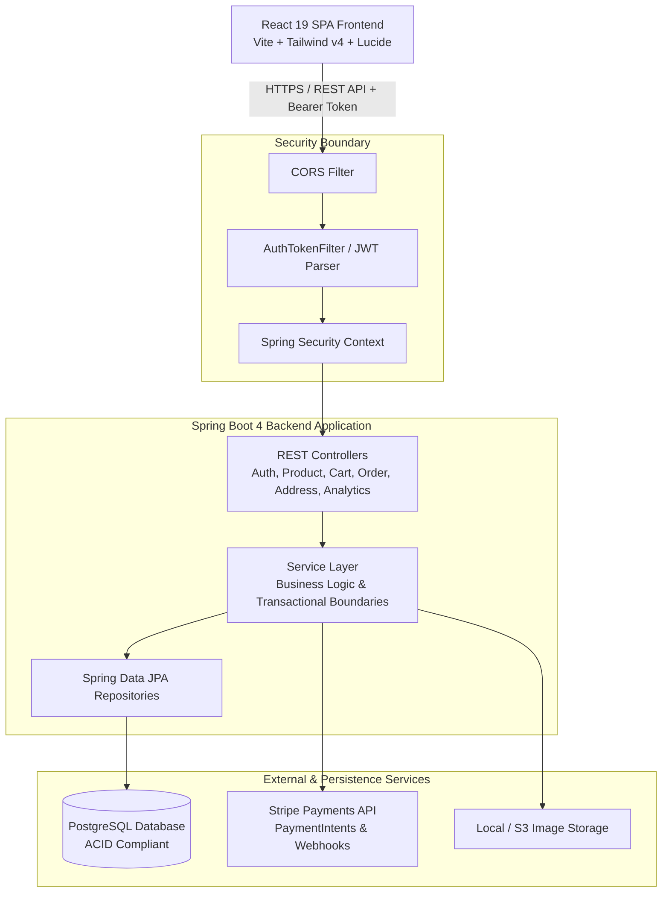
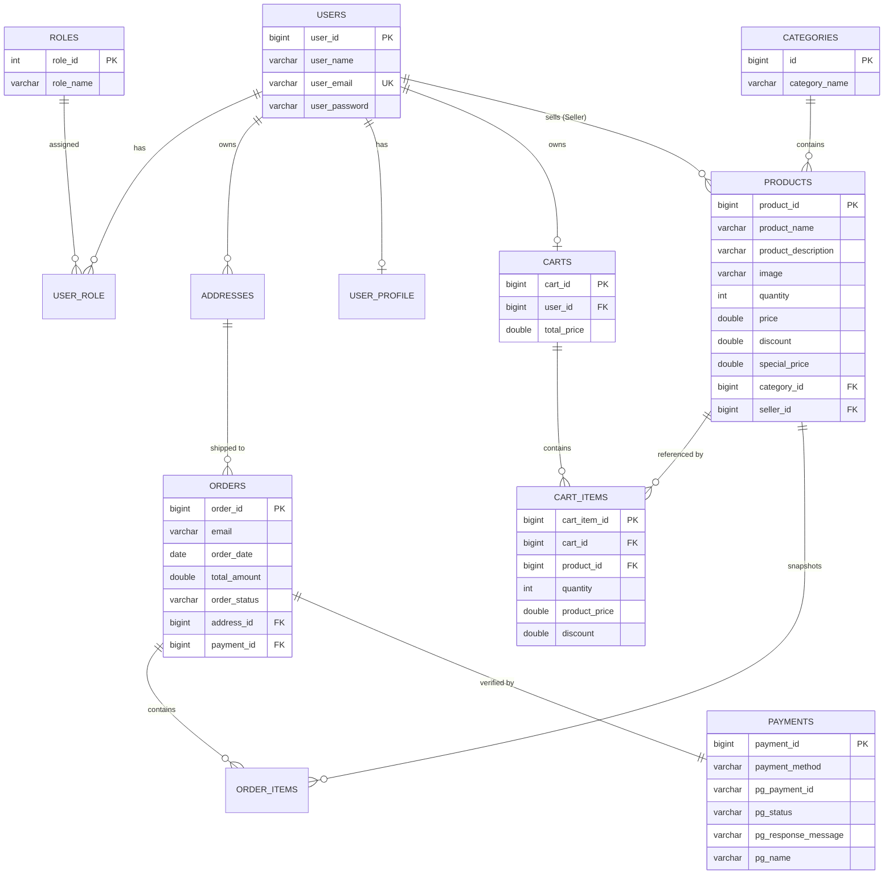
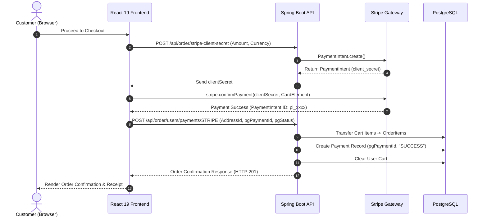

# 🛍️ Aureza — Modern Full-Stack E-Commerce Platform

<div align="center">


[](https://spring.io/projects/spring-boot)
[](https://www.oracle.com/java/)
[](https://react.dev/)
[](https://vitejs.dev/)
[](https://tailwindcss.com/)
[](https://www.postgresql.org/)
[](https://stripe.com/)
[](https://jwt.io/)
[](https://www.docker.com/)

**A modern, enterprise-grade multi-role E-Commerce ecosystem built with Spring Boot 4 (Java 21), React 19, Tailwind CSS v4, PostgreSQL, Stripe payments, and JWT-secured Role-Based Access Control (RBAC).**

[Live Application Demo](https://aureza-store.vercel.app) • [Backend API Docs (Swagger)](https://aureza-backend.onrender.com/swagger-ui.html) • [End-to-End Documentation](./DOCUMENTATION.md) • [Report Bug](https://github.com/TaquiAlam/Aureza-EcommerceApplication/issues)

</div>

---

## 📑 Table of Contents

- [Overview](#-overview)
- [System Architecture](#-system-architecture)
- [Key Features](#-key-features)
  - [Customer / Buyer](#-customer--buyer)
  - [Seller / Merchant](#-seller--merchant)
  - [Super Admin](#-super-admin)
- [Tech Stack](#-tech-stack)
- [Project Directory Structure](#-project-directory-structure)
  - [Backend Structure (Spring Boot)](#backend-structure-sb-ecombackend)
  - [Frontend Structure (React + Vite)](#frontend-structure-ecom-frontned)
- [Database Design & Entity Relationship](#-database-design--entity-relationship)
- [Security & Authentication](#-security--authentication)
- [REST API Specifications](#-rest-api-specifications)
- [Payment Gateway Integration](#-payment-gateway-integration)
- [Local Setup & Installation](#-local-setup--installation)
  - [Prerequisites](#prerequisites)
  - [Database Setup](#1-database-setup)
  - [Backend Setup](#2-backend-setup)
  - [Frontend Setup](#3-frontend-setup)
- [Docker Deployment](#-docker-deployment)
- [Environment Configuration](#-environment-configuration)
- [Author & Acknowledgments](#-author--acknowledgments)

---

## 🌟 Overview

**Aureza** is an end-to-end, multi-vendor electronic commerce platform engineered for high performance, modularity, and smooth user experience. The application separates concerns through a decoupled **RESTful Backend** and a fast, responsive **Single Page Application (SPA)** frontend with Atomic Design UI components.

### Highlights
- 🔐 **Multi-Tier Role-Based Security**: Seamless switching between Customer (`ROLE_USER`), Merchant (`ROLE_SELLER`), and Platform Administrator (`ROLE_ADMIN`).
- 💳 **Dual Payment Architecture**: Integrated Stripe Payment Elements for cards + Custom Indian UPI Payment Gateway with dynamic QR code generation.
- ⚡ **Real-time Cart & Inventory Management**: Automatic price calculations, coupon/discount evaluation, and instant stock deduction.
- 📊 **Executive Analytics**: Real-time admin dashboard metrics including total revenue, order statuses, user acquisition, and sales volumes.
- 🎨 **Atomic Design UI**: Built with React 19, Tailwind CSS v4, and Lucide icons for responsive mobile-first layouts.

---

## 🏛 System Architecture

The Aureza ecosystem follows a decoupled, stateless Client-Server micro-architecture:



---

## 🚀 Key Features

### 🛒 Customer / Buyer
* **Interactive Catalog**: Search products by keyword, filter by categories, and sort dynamically (price, discount, latest).
* **Shopping Cart**: Real-time quantity adjustments, cart persistence in database, and item removal.
* **Multi-Address Management**: Add, update, select, and manage multiple delivery addresses.
* **Frictionless Checkout**: 3-step checkout stepper (Address Selection ➔ Payment Method ➔ Order Review).
* **Payment Choices**: 
  - Credit/Debit Cards via **Stripe Elements** (stateless client-secret flow)
  - Instant UPI QR & UPI ID direct merchant transfer
  - Cash on Delivery (COD)
* **Order History & Tracking**: Real-time status badges (`PENDING`, `PROCESSING`, `SHIPPED`, `DELIVERED`, `CANCELLED`).
* **Profile Management**: Update personal info and upload avatar pictures.

### 🏬 Seller / Merchant
* **Dedicated Seller Portal**: Custom dashboard layout isolating merchant operations.
* **Product Catalog Management**: Add products with image upload, set MSRP, discount percentages, and inventory quantity.
* **Automatic Price Calculation**: Special price calculated automatically from original price and discount.
* **Merchant Order Fulfillment**: View orders containing items sold by the merchant and update shipping statuses.

### 🛡️ Super Admin
* **Executive Metrics Dashboard**: Live analytics (Total Sales, Revenue, Total Orders, Active Users, Sellers).
* **Category Administration**: Add, update, or remove product categories.
* **Global Inventory Control**: Manage all products across all sellers.
* **Merchant Onboarding & Auditing**: Paginated view and management of all registered sellers.
* **Global Order Management**: Update order lifecycle statuses and view complete payment receipts.

---

## 💻 Tech Stack

### ⚙️ Backend
| Technology | Version | Description |
| :--- | :--- | :--- |
| **Java** | 21 (LTS) | Modern Java runtime with virtual threads & pattern matching |
| **Spring Boot** | 4.1.1 | Enterprise application framework |
| **Spring Security** | 6.x | Role-based authorization & authentication |
| **JJWT (io.jsonwebtoken)** | 0.13.0 | Secure JSON Web Token creation & parsing |
| **Spring Data JPA** | Latest | Object-relational mapping via Hibernate |
| **PostgreSQL** | 16 | ACID-compliant production relational database |
| **ModelMapper** | 3.2.4 | Intelligent Entity-DTO transformation |
| **Stripe Java SDK** | 33.4.0 | Server-side Stripe PaymentIntent creation |
| **SpringDoc OpenAPI** | 3.1.1 | Automated Swagger UI & OpenAPI 3.0 documentation |
| **Lombok** | 1.18.42 | Boilerplate code reduction |

### 🎨 Frontend
| Technology | Version | Description |
| :--- | :--- | :--- |
| **React** | 19.0.0 | High-performance UI rendering engine |
| **Vite** | 6.0.5 | Ultra-fast build tool and development server |
| **Tailwind CSS** | 4.3.3 | Next-generation utility-first CSS styling engine |
| **React Router** | 7.1.1 | Client-side routing with nested layouts & route guards |
| **Axios** | 1.7.9 | HTTP client with automatic Bearer token interceptor |
| **Stripe React** | 6.11.0 | Official Stripe Elements checkout components |
| **Lucide React** | 0.468.0 | Clean, modern vector icon set |
| **React Hot Toast** | 2.6.1 | Smooth notifications and error feedback |

---

## 📁 Project Directory Structure

```text
Aureza-EcommerceApplication/
├── .gitignore                          # Global git exclusion rules
├── README.md                           # Main GitHub Project Showcase
├── DOCUMENTATION.md                    # Comprehensive End-to-End Technical Documentation
├── ecommerce-er-diagram.pdf            # Visual Database ER Diagram Reference
│
├── SB-ecomBackend/                     # ==========================================
│   │                                   # 🍃 SPRING BOOT BACKEND SERVICE
│   │                                   # ==========================================
│   ├── pom.xml                         # Maven dependencies & build configurations
│   ├── Dockerfile                      # Multi-stage production container build
│   └── src/
│       ├── main/
│       │   ├── java/com/ecommerce/project/
│       │   │   ├── SbEcomApplication.java    # Spring Boot entry point & DB seeder
│       │   │   │
│       │   │   ├── Controller/               # REST API Endpoints
│       │   │   │   ├── AddressController.java    # Delivery address CRUD
│       │   │   │   ├── AnalyticsController.java  # Admin dashboard telemetry
│       │   │   │   ├── AuthController.java       # Signin, signup, signout, sellers
│       │   │   │   ├── CartController.java       # Cart items & quantity sync
│       │   │   │   ├── CategoryController.java   # Category management
│       │   │   │   ├── OrderController.java      # Order placement & Stripe secrets
│       │   │   │   ├── ProductController.java    # Product catalog & file uploads
│       │   │   │   └── UserController.java       # User profile & photo endpoints
│       │   │   │
│       │   │   ├── Model/                    # JPA Entities (Database Tables)
│       │   │   │   ├── Address.java              # User shipping addresses
│       │   │   │   ├── AppRole.java              # Enum: ROLE_USER, ROLE_SELLER, ROLE_ADMIN
│       │   │   │   ├── Cart.java                 # User shopping cart
│       │   │   │   ├── CartItem.java             # Individual items in cart
│       │   │   │   ├── CategoryModel.java        # Product taxonomy
│       │   │   │   ├── Order.java                # Order header record
│       │   │   │   ├── OrderItem.java            # Order line items
│       │   │   │   ├── Payment.java              # Payment transaction record
│       │   │   │   ├── Product.java              # Product entity
│       │   │   │   ├── Role.java                 # Security role entity
│       │   │   │   ├── User.java                 # User account entity
│       │   │   │   └── UserProfile.java          # User profile bio & preferences
│       │   │   │
│       │   │   ├── Repositories/             # Spring Data JPA Interfaces
│       │   │   │   ├── AddressRepo.java
│       │   │   │   ├── CartItemRepository.java
│       │   │   │   ├── CartRepository.java
│       │   │   │   ├── CategoryRepo.java
│       │   │   │   ├── OrderItemRepo.java
│       │   │   │   ├── OrderRepo.java
│       │   │   │   ├── PaymentRepo.java
│       │   │   │   ├── ProductRepo.java
│       │   │   │   ├── RoleRepo.java
│       │   │   │   ├── UserProfileRepository.java
│       │   │   │   └── UserRepository.java
│       │   │   │
│       │   │   ├── Service/                  # Business Logic Layer
│       │   │   │   ├── AddressService(impl).java
│       │   │   │   ├── AnalyticsServics(impl).java
│       │   │   │   ├── AuthService(impl).java
│       │   │   │   ├── CartService(impl).java
│       │   │   │   ├── CategoryService(impl).java
│       │   │   │   ├── FileService(impl).java
│       │   │   │   ├── OrderService(impl).java
│       │   │   │   ├── ProductService(impl).java
│       │   │   │   ├── StripeService(impl).java
│       │   │   │   └── UserService(impl).java
│       │   │   │
│       │   │   ├── Payload/                  # Data Transfer Objects (DTOs)
│       │   │   │   ├── AddressDTO.java
│       │   │   │   ├── APIResponce.java
│       │   │   │   ├── CartDTO.java / CartItemDTO.java
│       │   │   │   ├── CategoryRequestDTO.java / CategoryResponseDTO.java
│       │   │   │   ├── OrderRequestDTO.java / OrderResponceDTO.java
│       │   │   │   ├── ProductRequestDTO.java / ProductResponceDTO.java
│       │   │   │   ├── SignupRequest.java / UserLoginRequest.java
│       │   │   │   └── StripePaymentDto.java
│       │   │   │
│       │   │   ├── security/                 # Security Configuration & JWT
│       │   │   │   ├── config/
│       │   │   │   │   ├── securityConfig.java   # FilterChain, CORS, Route rules
│       │   │   │   │   └── WebConfig.java        # Static resource handler for images
│       │   │   │   ├── jwt/
│       │   │   │   │   ├── AuthEntryPointJwt.java # Unauthorized 401 error handler
│       │   │   │   │   ├── AuthTokenFilter.java   # Per-request JWT authentication
│       │   │   │   │   └── JwtUtils.java          # Token generator & claims parser
│       │   │   │   └── Service/
│       │   │   │       ├── UserDetailsimpl.java
│       │   │   │       └── UserDetailsServiceimpl.java
│       │   │   │
│       │   │   ├── Exception/                # Global Exception Handling
│       │   │   │   ├── APIException.java
│       │   │   │   ├── MyGlobalExceptionHandler.java
│       │   │   │   └── ResourceNotFoundException.java
│       │   │   │
│       │   │   ├── config/                   # Constants & ModelMapper Config
│       │   │   └── utils/                    # Auth helper utilities (AuthUtils.java)
│       │   │
│       │   └── resources/
│       │       └── application.properties    # PostgreSQL, JWT, Stripe configurations
│       │
│       └── test/                             # Unit & Integration Tests
│
└── ecom-frontned/                      # ==========================================
    │                                   # ⚛️ REACT 19 + VITE FRONTEND SPA
    │                                   # ==========================================
    ├── package.json                    # Dependencies & build scripts
    ├── vite.config.js                  # Vite dev server proxy configuration
    ├── vercel.json                     # Vercel deployment rewrites & SPA fallback
    ├── .env                            # Client environment variables
    ├── index.html                      # HTML5 entry point
    └── src/
        ├── App.jsx                     # Route definitions & guards (Public, Private, Admin, Seller)
        ├── main.jsx                    # Root provider mounting (Auth, Cart, Toaster)
        ├── index.css                   # Global styles & Tailwind v4 imports
        │
        ├── api/                        # Axios API Clients
        │   ├── axiosConfig.js          # Base URL, Bearer interceptors & error handlers
        │   ├── authApi.js              # Login, register, profile calls
        │   ├── productApi.js           # Catalog, pagination & seller CRUD
        │   ├── cartApi.js              # Cart operations
        │   ├── categoryApi.js          # Categories fetch/update
        │   ├── orderApi.js             # Order placement & Stripe secrets
        │   ├── addressApi.js           # Address CRUD
        │   ├── userApi.js              # Profile data
        │   └── analyticsApi.js        # Admin metrics fetch
        │
        ├── context/                    # React Context Global State
        │   ├── AuthContext.jsx         # User session, JWT token, role management
        │   └── CartContext.jsx         # Cart items count, refresh triggers
        │
        ├── hooks/                      # Custom Reusable React Hooks
        │   ├── useAuth.js              # Quick access to AuthContext
        │   ├── useCart.js              # Quick access to CartContext
        │   └── useApiError.js          # Unified toast error display
        │
        ├── components/                 # Atomic Design Component Hierarchy
        │   ├── atoms/                  # Button, Input, Badge, Spinner, EmptyState
        │   ├── molecules/              # FormField, SearchBar, QuantityControl, Pagination
        │   ├── organisms/              # Navbar, Footer, ProductCard, ProductGrid, AddressCard
        │   ├── templates/              # MainLayout, AdminLayout, SellerLayout, PrivateRoute
        │   └── error/                  # ErrorBoundary, ErrorFallback
        │
        ├── pages/                      # Page Components
        │   ├── HomePage.jsx            # Hero banner, featured categories & products
        │   ├── ProductsPage.jsx        # Catalog with search, filters & sorting
        │   ├── ProductDetailPage.jsx   # Product info, gallery, pricing & add-to-cart
        │   ├── CartPage.jsx            # Cart review, quantity updates, order summary
        │   ├── CheckoutPage.jsx        # 3-step checkout with Stripe & UPI
        │   ├── PaymentConfirmationPage.jsx # Order success receipt
        │   ├── AddressesPage.jsx       # User address book management
        │   ├── ProfilePage.jsx         # User account & photo upload
        │   ├── LoginPage.jsx / SignupPage.jsx # Authentication screens
        │   ├── NotFoundPage.jsx        # 404 handler
        │   ├── admin/                  # Admin Dashboard, Products, Categories, Orders, Sellers
        │   └── seller/                 # Seller Products & Seller Orders
        │
        └── utils/                      # Helper formatting & image resolver utilities
```

---

## 🗄️ Database Design & Entity Relationship

The database schema is structured for relational integrity, performance, and transactional safety:



---

## 🔒 Security & Authentication

Aureza implements an industry-standard **Stateless JWT Security Architecture**:

1. **Authentication Handshake**:
   - The user submits login credentials (`POST /api/auth/signin`).
   - `DaoAuthenticationProvider` verifies credentials against BCrypt hashed passwords in PostgreSQL.
   - `JwtUtils` generates a cryptographically signed HMAC-SHA256 JWT containing user ID, username, and assigned roles.
   - The server sets an **HttpOnly Cookie** (`springBootEcom`) and returns a **Bearer Token** in the JSON response payload.

2. **Per-Request Authorization (`AuthTokenFilter`)**:
   - For every incoming HTTP request, the filter inspects the `Authorization` header (`Bearer <token>`) and fallback cookies.
   - Tokens are validated for expiration and signature tampering.
   - Upon successful verification, user authorities (`ROLE_USER`, `ROLE_SELLER`, `ROLE_ADMIN`) are injected into Spring's `SecurityContextHolder`.

3. **CORS & CSRF**:
   - CSRF is disabled for stateless REST sessions.
   - Cross-Origin Resource Sharing (CORS) is configured for both local ports (`http://localhost:5173`) and cloud domains (`https://*.vercel.app`).

---

## 🔌 REST API Specifications

| Module | Method | Endpoint | Access Level | Description |
| :--- | :---: | :--- | :---: | :--- |
| **Auth** | `POST` | `/api/auth/signup` | Public | Register new customer or seller |
| **Auth** | `POST` | `/api/auth/signin` | Public | Login and obtain JWT token |
| **Auth** | `GET` | `/api/auth/user` | Authenticated | Fetch current user session details |
| **Auth** | `POST` | `/api/auth/signout` | Authenticated | Logout & clear session cookie |
| **Products**| `GET` | `/api/public/products` | Public | Paginated products list with search & filter |
| **Products**| `GET` | `/api/public/products/{id}` | Public | Single product details |
| **Products**| `POST` | `/api/seller/categories/{cId}/product` | Seller / Admin | Create new product |
| **Products**| `PUT` | `/api/seller/products/{id}` | Seller / Admin | Update product details |
| **Products**| `DELETE`| `/api/seller/products/{id}` | Seller / Admin | Delete product |
| **Products**| `PUT` | `/api/seller/products/{id}/image`| Seller / Admin | Upload product display image |
| **Categories**| `GET` | `/api/public/categories` | Public | List all categories with pagination |
| **Categories**| `POST`| `/api/admin/categories` | Admin | Create new category |
| **Categories**| `DELETE`| `/api/admin/categories/{id}` | Admin | Delete existing category |
| **Cart** | `GET` | `/api/carts/users/cart` | Authenticated | Retrieve current user's cart |
| **Cart** | `POST` | `/api/carts/products/{pId}/quantity/{qty}` | Authenticated | Add product item to cart |
| **Cart** | `PUT` | `/api/cart/products/{pId}/quantity/{op}` | Authenticated | Increase or decrease cart quantity |
| **Cart** | `DELETE`| `/api/carts/{cId}/product/{pId}` | Authenticated | Remove item from cart |
| **Addresses**| `GET` | `/api/users/addresses` | Authenticated | Retrieve user delivery addresses |
| **Addresses**| `POST`| `/api/addresses` | Authenticated | Save new delivery address |
| **Addresses**| `DELETE`| `/api/addresses/{id}` | Authenticated | Delete saved address |
| **Orders** | `POST` | `/api/order/stripe-client-secret` | Authenticated | Create Stripe PaymentIntent |
| **Orders** | `POST` | `/api/order/users/payments/{method}` | Authenticated | Place order from cart |
| **Orders** | `GET` | `/api/seller/orders` | Seller | Orders belonging to seller's products |
| **Orders** | `GET` | `/api/admin/orders` | Admin | All orders across the store |
| **Orders** | `PUT` | `/api/admin/orders/{id}/status` | Admin / Seller | Update order fulfillment status |
| **Analytics**| `GET` | `/api/admin/analytics` | Admin | Aggregate revenue, orders & sales metrics |

---

## 💳 Payment Gateway Integration

Aureza features a complete, PCI-compliant payment workflow supporting both international and domestic payment channels:



---

## 🛠️ Local Setup & Installation

### Prerequisites
- **Java JDK 21** or later installed ([Download Oracle JDK 21](https://www.oracle.com/java/technologies/downloads/))
- **Node.js 20+** and **npm** ([Download Node.js](https://nodejs.org/))
- **PostgreSQL 15+** running locally ([Download PostgreSQL](https://www.postgresql.org/download/))
- **Git** installed

---

### 1. Database Setup
Launch `psql` or pgAdmin and create the application database:

```sql
CREATE DATABASE ecommerce;
```

---

### 2. Backend Setup

1. Open your terminal and navigate to the backend directory:
   ```bash
   cd SB-ecomBackend
   ```

2. Configure `src/main/resources/application.properties` with your PostgreSQL and Stripe credentials:
   ```properties
   spring.datasource.url=jdbc:postgresql://localhost:5432/ecommerce
   spring.datasource.username=postgres
   spring.datasource.password=your_postgres_password

   # Stripe Secret Key (from Stripe Dashboard)
   stripe.secret.key=sk_test_51...
   ```

3. Build and launch the Spring Boot server:
   ```bash
   # On Windows
   ./mvnw.cmd spring-boot:run

   # On Linux / macOS
   ./mvnw spring-boot:run
   ```
   *The backend will boot up at `http://localhost:8080` with automatic role and product seeding.*
   *Swagger API Documentation will be available at `http://localhost:8080/swagger-ui.html`.*

---

### 3. Frontend Setup

1. Open a new terminal tab and navigate to the frontend directory:
   ```bash
   cd ecom-frontned
   ```

2. Install all dependencies:
   ```bash
   npm install
   ```

3. Verify or adjust the `.env` file:
   ```env
   VITE_API_URL=http://localhost:8080
   VITE_FRONTEND_URL=http://localhost:5173
   VITE_STRIPE_PUBLISHABLE_KEY=pk_test_...
   VITE_MERCHANT_UPI_ID=your_upi_id@bank
   VITE_MERCHANT_NAME=Your Store Name
   ```

4. Launch the Vite development server:
   ```bash
   npm run dev
   ```
   *The frontend will run at `http://localhost:5173`.*

---

## 🐳 Docker Deployment

The backend contains a production-ready multi-stage `Dockerfile`:

```bash
# In SB-ecomBackend directory
docker build -t aureza-backend:latest .

# Run container with environment variables
docker run -d -p 8080:8080 \
  -e SPRING_DATASOURCE_URL=jdbc:postgresql://host.docker.internal:5432/ecommerce \
  -e SPRING_DATASOURCE_USERNAME=postgres \
  -e SPRING_DATASOURCE_PASSWORD=your_password \
  -e STRIPE_SECRET_KEY=sk_test_... \
  --name aureza-api aureza-backend:latest
```

---

## ⚙️ Environment Configuration

### Backend Environment Variables
| Variable | Description | Default Local Value |
| :--- | :--- | :--- |
| `SPRING_DATASOURCE_URL` | JDBC Connection URL | `jdbc:postgresql://localhost:5432/ecommerce` |
| `SPRING_DATASOURCE_USERNAME` | Database username | `postgres` |
| `SPRING_DATASOURCE_PASSWORD` | Database password | `zohra` |
| `STRIPE_SECRET_KEY` | Stripe Private Secret Key | `sk_test_...` |
| `SPRING_APP_JWT_SECRET` | Secret key for signing JWT tokens | Configured in properties |
| `SPRING_APP_JWT_EXPIRATION_MS` | JWT validity duration (ms) | `3000000` (~50 mins) |

### Frontend Environment Variables (`.env`)
| Variable | Description |
| :--- | :--- |
| `VITE_API_URL` | Base API target for Spring Boot backend |
| `VITE_FRONTEND_URL` | Client URL used for Stripe redirects |
| `VITE_STRIPE_PUBLISHABLE_KEY` | Public Stripe key for client-side card tokenization |
| `VITE_MERCHANT_UPI_ID` | Virtual Payment Address (VPA) for UPI transfers |
| `VITE_MERCHANT_NAME` | Business name displayed in UPI apps |

---

## 🤝 Contribution Guidelines

1. Fork the Project Repository.
2. Create your Feature Branch (`git checkout -b feature/AmazingFeature`).
3. Commit your Changes (`git commit -m 'Add some AmazingFeature'`).
4. Push to the Branch (`git push origin feature/AmazingFeature`).
5. Open a Pull Request.

---

## 👤 Author

**Mohammad Taqui Alam**
- **GitHub**: [@TaquiAlam](https://github.com/TaquiAlam)
- **Repository**: [Aureza-EcommerceApplication](https://github.com/TaquiAlam/Aureza-EcommerceApplication)

---

<div align="center">
  <sub>Built with ❤️ using Spring Boot & React. If you found this project helpful, please give it a ⭐️ on GitHub!</sub>
</div>
